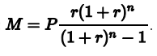
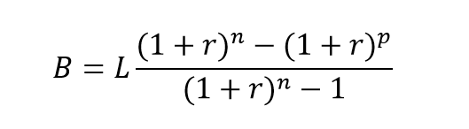

## Mortgage Calculator 1.0

Welcome Mortgage Calculator 1.0 this application help you calculte your monthly mortgage payment.
In order to calculate the monthly payment, we can rely on a relatively simple equation. The monthly payment can be represented as follows:


where

- M is your monthly patment
- P is your principal
- r is your monthly intrest rate, calculated by dividing your annual intrest rate by 12
- n is your number of payments(the number of months you will be paying the loan)

The next formula is used to calculate the remaining loan balance (B) of a fixed payment loan after p months.



- L is the obtained loan i.e P of the 1st equation
- p is the number of payment made

## Folder Structure

The workspace contains two folders by default, where:

- `src`: the folder to maintain sources
- `lib`: the folder to maintain dependencies

Meanwhile, the compiled output files will be generated in the `bin` folder by default.

> If you want to customize the folder structure, open `.vscode/settings.json` and update the related settings there.

## Project Aims

This project is aim at learning basic Java programming

### Using Scanner

Scanner class that is defined in Java.util is used to read input from the user. when we create new Scanner object our IDE automatically import it.

- To read user input from the terminer we pass System.in as argument to our Scanner object.

```java
//Creating new Scanner Object and passing System.in as argument
Scanner Scanner = new Scanner(System.in);
```

Scanner object has several method for reading input from user all begin with next. for example,
next() and nextLine () are use to read strings from the user
